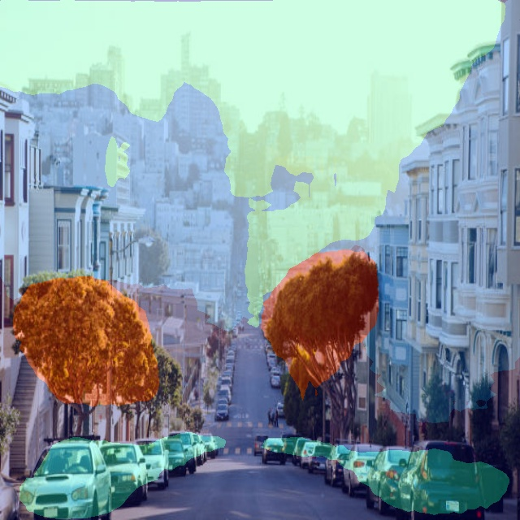

# Urban Scene Segmentation



## Overview
This project implements an end-to-end semantic segmentation pipeline for urban scenes using the DeepLabV3 model with a MobileNetV2 encoder. It includes preprocessing, inference, ONNX conversion, quantization, and a FastAPI-based REST API for serving predictions.

## Project Structure

- `api.py`: FastAPI application for serving the model.
- `demo.py`: Example script to run segmentation pipeline locally.
- `src/`: Core modules (preprocessing, model, quantization, ONNX conversion).
- `configs/`: Configuration files.
- `data/`: Input images and test data.
- `weights/`: Pretrained and quantized model weights.
- `logs/`: Training and evaluation logs.

## Why DeepLabV3?

- DeepLabV3 is a state-of-the-art architecture for dense prediction.
- Uses atrous convolution to capture multi-scale context.
- High performance with low computational overhead, especially when paired with MobileNetV2.
- Ideal for real-time and resource-constrained environments.

## Why PyTorch?

- Strong ecosystem support for semantic segmentation models.
- Easy to integrate with ONNX and quantization toolchains.
- Flexible training and debugging with intuitive API.

## Setup & Installation

### 1. Clone the Repository
```bash
git clone https://github.com/msalaho1/urban-scene-segmentation.git
cd urban-scene-segmentation
```

### 2. Install Dependencies
```bash
pip install -r requirements.txt
```

Note: Python 3.10 is required. Weights are already uploaded to the GitHub repo.

## Running the API

### 1. Start the Server
```bash
uvicorn api:app --host 0.0.0.0 --port 8000
```

### 2. Health Check
```bash
curl http://localhost:8000/health
```

### 3. Send a Prediction Request
```bash
curl -X POST "http://127.0.0.1:8000/predict/" -F "file=@data/testing/image1.jpeg"
```

## Using Docker

### 1. Build the Docker Image
```bash
docker build -t uss .
```

### 2. Run the Container with Volume Mounting
```bash
docker run -p 8000:8000 -v $(pwd)/output:/app/output uss
```

## Model Trials & Experiments

### Initial Trials
**note** iam using google colab T4 gpu for training which is a limited memory resource.
- UNet + ResNet-34: Moderate performance and high memory usage.
   - results: Epoch 10/10 — Train Loss: 1.6678, Val Loss: 1.6852 (trainig took almost 3 hours) 
- UNet + MobileNetV2: Improved speed, reduced size and slight accuracy drop so i increased number of epochs
   - results: results: Epoch 20/20 — Train Loss: 0.3578, Val Loss: 1.2852 (trainig took almost 1.5 hours) 
- DeeplabV3 + MobileNetV2 (latest one): Improved speed with a huge difference, reduced memory consumption 
   - results: Epoch 31/50 — Train Loss: 0.3652, Val Loss: 1.3328
   - No improvement at epoch 31 — patience: 5/5
   - Early stopping triggered: No improvement for 5 consecutive epochs.
   **note** for further details please check the training notebook at ```./src/train.ipynb```

### discussion about results:

- from the final results the model is likely to be overfitting (works well on training data and not so good with validation data, not generalized well)
- one of the limitations is the training dataset size which is extremely small.
- MobileNetV2 is a lightweight encoder that trades accuracy for speed, it is not the best option in terms of accuracy or limited data resources.
- when i was investigating the dataset before training i noticed some data mislabeling cases, and this is a hugh limitations, for a solid training pipeline dataset should be well labeled. 
- Data augmentation may be a good solution to generalize the model by simulating a wider variety of training examples.
- If data classes are imbalanced a weighted loss function maybe a good tool to handle data imbalance. 

### Optimizations Applied
- Reduced batch size and image size to fit GPU memory.
- Enabled mixed precision training for speed and memory efficiency.
- Used weight decay to prevent overfitting.

### Final Model
- DeepLabV3 + MobileNetV2: Best balance of accuracy and resource usage.

## Training Setup & Data Investigation

- 149 images total: 112 training, 37 validation.
- All resized to 640x640, no augmentations during training.
- Masks named with `_mask` suffix, located alongside images.
- Class maps verified for training/validation consistency.

## Training Enhancements

- Learning Rate Scheduler: ReduceLROnPlateau
- Early Stopping: Triggered after 5 epochs with no improvement.
- Data Augmentation: Gaussian blur, normalization.
- Visualization: Output overlays for visual assessment.

## Quantization & ONNX Conversion

### 1. Quantization
```bash
python -m src.quantize.py
```

### 2. ONNX Conversion
```bash
python -m src.conv2onnx.py
```

Outputs are saved in `src/weights/`.

## Example Usage

Run the full pipeline using the demo script:
```bash
python demo.py
```

This processes input images and shows the predicted segmentation.

## Logs

Logs for inference are stored in the `logs/` directory for inspection and debugging.


### logs example 
```bash
2025-05-11 09:13:03 - inference - INFO - Total processing time: 0.96 seconds.
2025-05-11 09:13:15 - inference - INFO - Visualizing and saving the output mask.
2025-05-11 09:13:15 - inference - INFO - Total processing time: 0.95 seconds.
```
***Please note that the log setup was configured for the Regina/Canada time zone.***